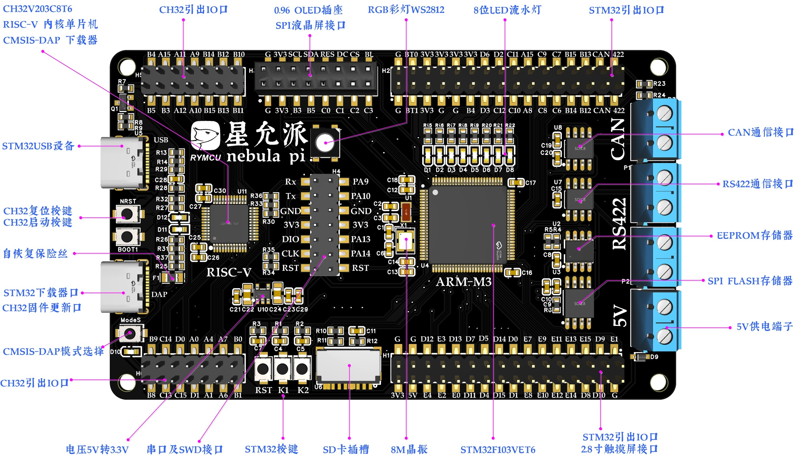

1. # 星允派 STM32F103 开发板
  **探索双核新境界，ARM Cortex-M3 与 RISC-V 的完美融合，双重体验，释放无限创造力！**

  

  还在为选择 ARM 还是 RISC-V 而犹豫？小孩子才做选择，成年人全都要！Nebula Pi 开发板，一块板卡，双重体验，释放无限创造力！
  ✨ 核心亮点，不容错过： ✨
  1. 🔥 双核驱动，性能加倍： 同时搭载广受欢迎的 STM32F103VET6 (ARM Cortex-M3) 和新兴的 CH32V203C8T6 (RISC-V)，无论是学习研究、性能比对还是双核协作项目，一块板卡全搞定！
  2. 🔗 工业级通信，即插即用： 板载 CAN 和 RS422 通信接口，配备专用接线端子，无需额外购买收发器，轻松应对工业控制、汽车电子、多机通信等场景。
  3. 💡 调试无忧，开发顺畅： 内建针对 RISC-V (CH32) 的 CMSIS-DAP 下载器，结合独立的 Type-C 调试/下载接口，让您的开发调试流程如丝般顺滑。
  4. 💾 海量存储，随心扩展： 板载 EEPROM、SPI Flash 还不够？更有 Micro SD 卡槽，满足您对数据记录、固件存储、文件系统等各种大容量存储需求。
  5. 👀 视觉呈现，丰富多彩： 预留 0.96" OLED 直插座，提供通用 SPI 屏接口，更能驱动 2.8 寸触摸彩屏。配合板载 RGB 彩灯和 8 位流水灯，状态显示直观生动。
  6. 🛠 IO 丰富，扩展无限： 大量 GPIO 引脚整齐排列，来自 STM32 和 CH32 的双重扩展能力，无论是传感器、模块还是自定义电路，都能轻松接入。
  7. 🛡 稳定可靠，安全保护： 方便的 5V 端子输入，板载稳压电路，更有自恢复保险丝保驾护航，让您的创意实践无后顾之忧。
  8. 🖱 人机交互，触手可及： 板载多个按键（复位、启动、用户自定义），配合 LED 指示，调试交互简单直接。
  无论您是：
  渴望探索 RISC-V 新架构的学习者
  需要可靠平台的工程师
  追求极致性能与灵活性的开发者
  热衷 DIY 的创客爱好者
  RYMCU Nebula Pi 开发板都是您不容错过的理想之选！
  立即拥有 Nebula Pi，开启您的双核嵌入式探索之旅！

  
  