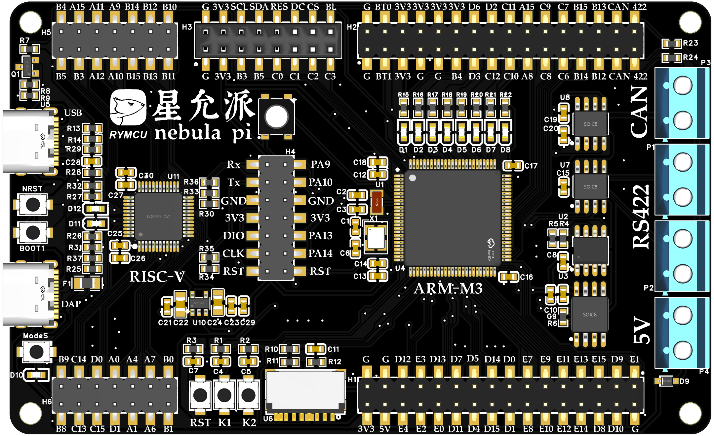
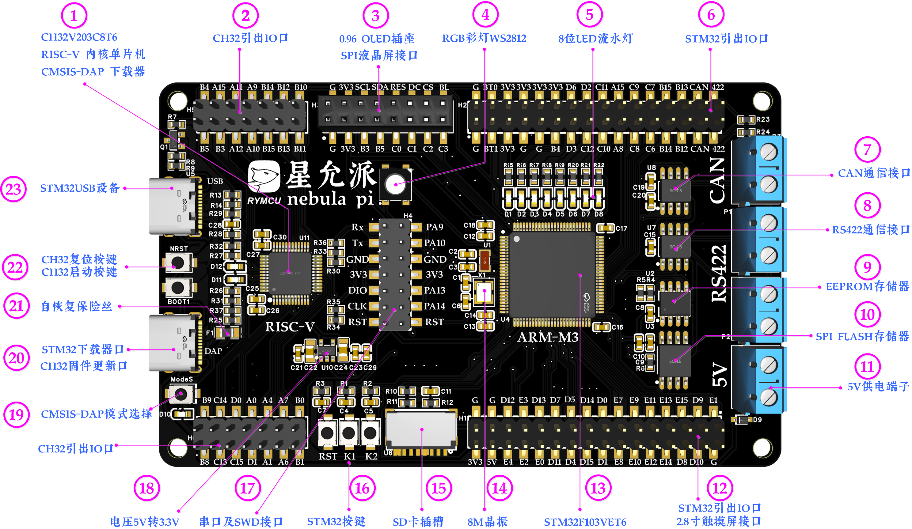
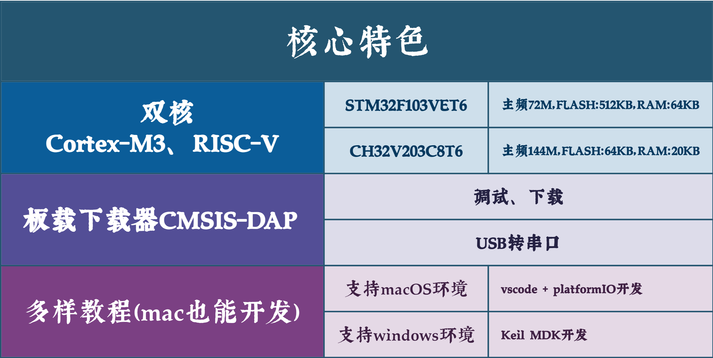
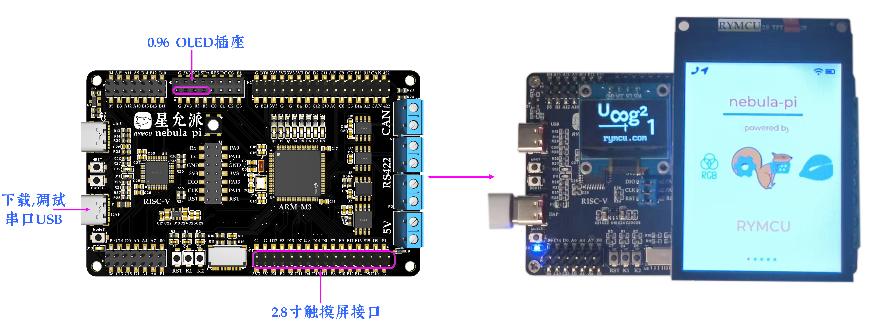
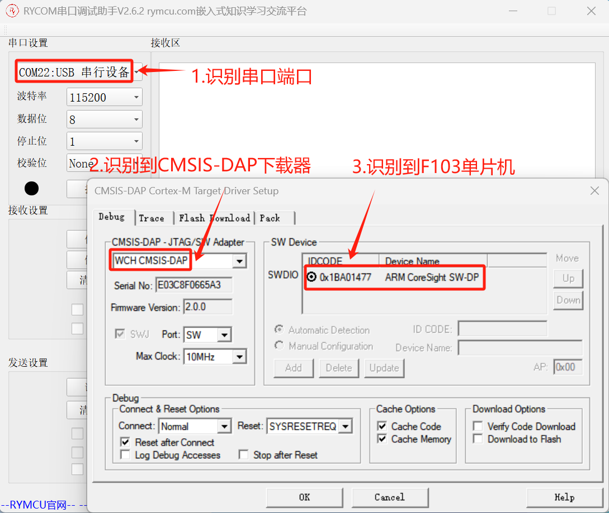
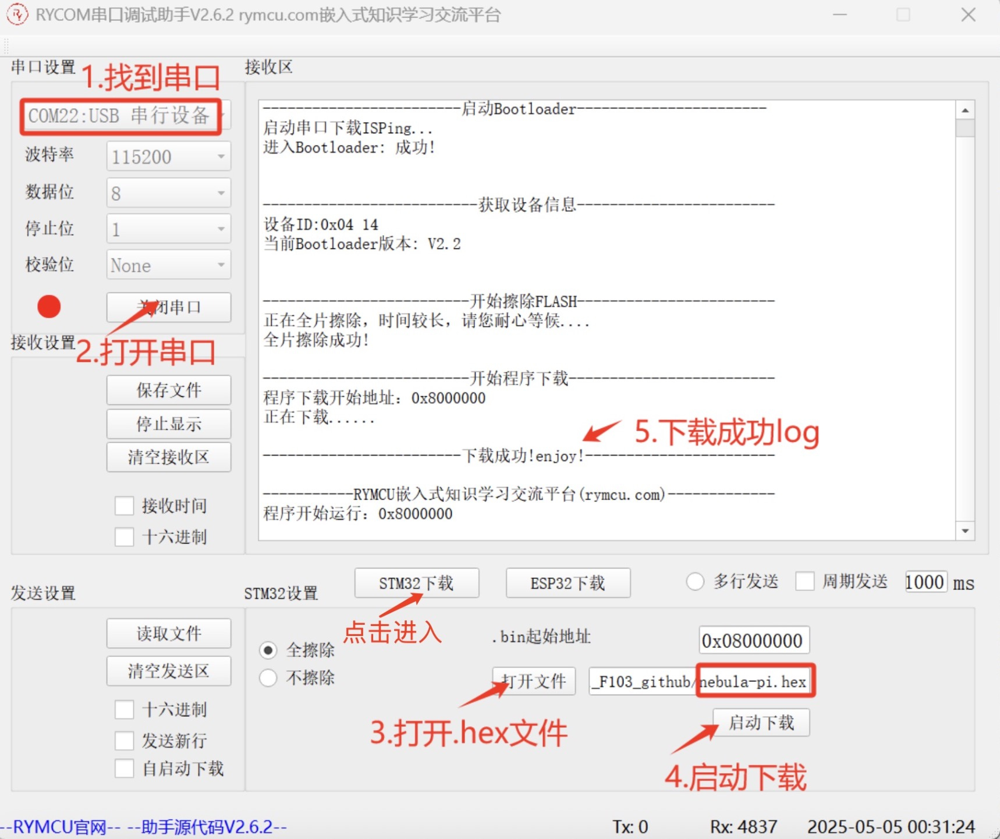
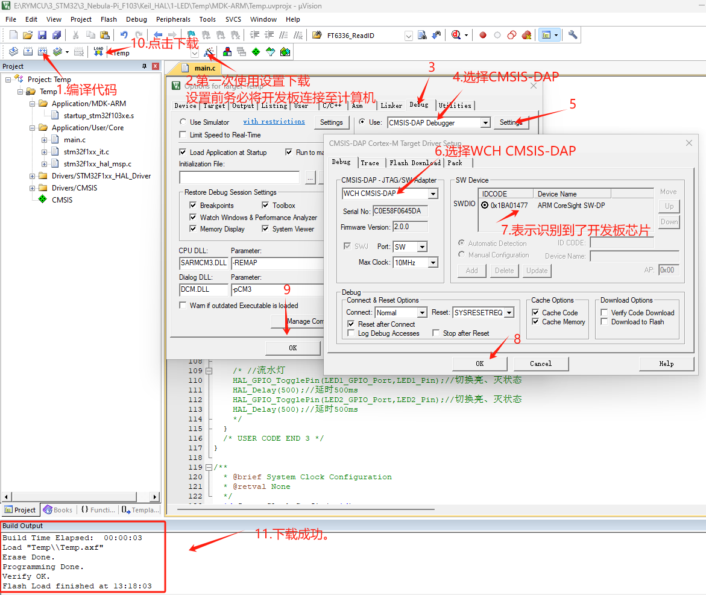
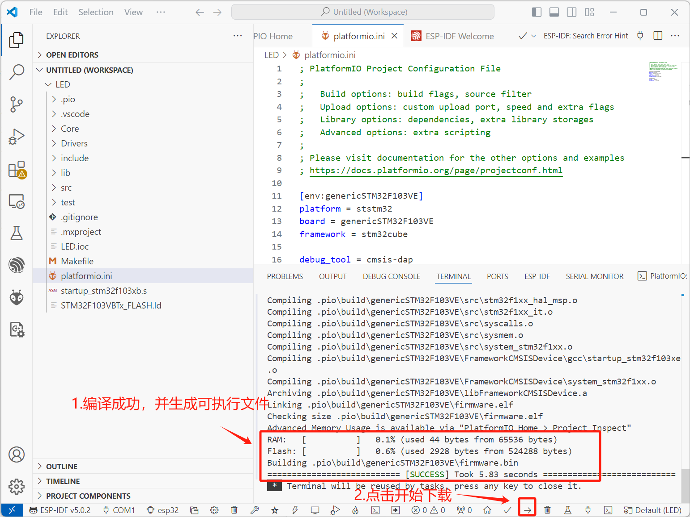
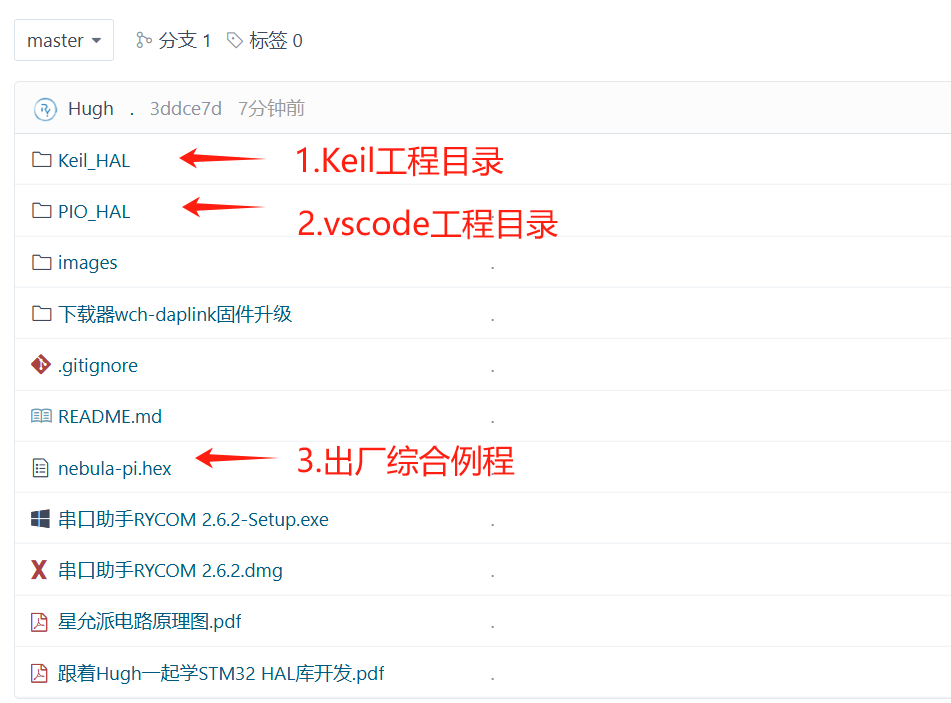
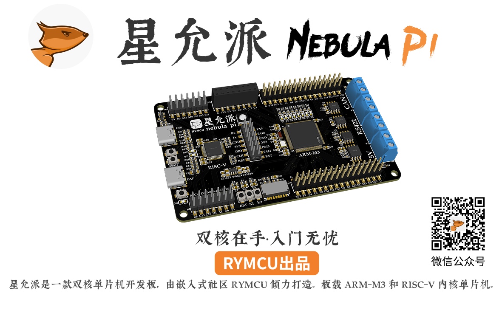

# 星允派 Nebula Pi 产品宣传视频脚本

## 📽️ 视频信息

- **视频时长**: 约 2-3 分钟
- **目标受众**: 嵌入式开发爱好者、电子工程师、高校学生
- **视频风格**: 科技感、专业、简洁明快

---

## 🎬 分镜脚本

### 【开场】0:00 - 0:15

| 时间 | 画面 | 配音/文案 | 图片素材 |
|------|------|-----------|----------|
| 0:00-0:05 | RYMCU Logo淡入，粒子特效汇聚 | *背景音乐渐起* |  |
| 0:05-0:10 | 开发板从暗处缓缓亮起，流光扫过 | "探索双核新境界" |  |
| 0:10-0:15 | 开发板全貌展示，缓慢旋转 | "双重体验，释放无限创造力" |  |

---

### 【产品引入】0:15 - 0:35

| 时间 | 画面 | 配音/文案 | 图片素材 |
|------|------|-----------|----------|
| 0:15-0:25 | 开发板特写，镜头从左到右滑动 | "还在为选择 ARM Cortex-M 还是 RISC-V 而犹豫？星允派 Nebula Pi，一块板卡，双重体验！" |  |
| 0:25-0:35 | 双核心芯片特写，分屏展示两颗芯片 | "同时搭载 STM32F103VET6 与 CH32V203C8T6，ARM 与 RISC-V 双核驱动，性能加倍！" |  |

---

### 【核心卖点展示】0:35 - 1:30

#### 🔥 卖点一：双核驱动 (0:35-0:50)

| 时间 | 画面 | 配音/文案 | 图片素材 |
|------|------|-----------|----------|
| 0:35-0:42 | 主芯片STM32特写，参数浮现 | "主 CPU：STM32F103VET6，Cortex-M3 内核，72MHz 主频，512K Flash，64K RAM" |  |
| 0:42-0:50 | 副芯片CH32特写，参数浮现 | "副 CPU：CH32V203C8T6，RISC-V 内核，144MHz 主频，出厂预装 CMSIS-DAP 下载器固件" |  |

#### 🔗 卖点二：丰富接口 (0:50-1:05)

| 时间 | 画面 | 配音/文案 | 图片素材 |
|------|------|-----------|----------|
| 0:50-0:57 | 接口区域特写，高亮CAN和RS422端子 | "板载 CAN 与 RS422 工业通信接口，配备专用接线端子，即插即用" |  |
| 0:57-1:05 | 存储芯片区域特写 | "板载 EEPROM、8MB SPI Flash、Micro SD 卡槽，海量存储随心扩展" |  |

#### 💡 卖点三：调试便捷 (1:05-1:15)

| 时间 | 画面 | 配音/文案 | 图片素材 |
|------|------|-----------|----------|
| 1:05-1:10 | Type-C接口特写 | "双 Type-C 接口设计，调试下载、USB 设备，分工明确" |  |
| 1:10-1:15 | DAP识别界面展示 | "RISC-V 核心出厂预装 CMSIS-DAP 固件，开箱即用" |  |

#### 👀 卖点四：视觉呈现 (1:15-1:30)

| 时间 | 画面 | 配音/文案 | 图片素材 |
|------|------|-----------|----------|
| 1:15-1:22 | OLED和RGB灯效展示 | "预留 0.96 寸 OLED 直插座，板载 RGB 彩灯与 8 位流水灯" |  |
| 1:22-1:30 | 2.8寸触摸屏展示 | "更可驱动 2.8 寸触摸彩屏，支持 LVGL 图形界面" |  |

---

### 【开发体验展示】1:30 - 2:10

#### ⚡ 三种下载方式 (1:30-2:00)

| 时间 | 画面 | 配音/文案 | 图片素材 |
|------|------|-----------|----------|
| 1:30-1:35 | 分屏展示三种方式图标 | "三种代码下载方式，满足不同开发习惯" | - |
| 1:35-1:45 | 串口下载演示 | "方式一：串口下载，使用 RYCOM 串口助手，简单直观" |  |
| 1:45-1:52 | Keil下载演示 | "方式二：Keil MDK，一键编译下载，专业高效" |  |
| 1:52-2:00 | VSCode下载演示 | "方式三：VSCode + PlatformIO，跨平台开发，macOS 与 Windows 通吃" |  |

#### 📚 丰富例程 (2:00-2:10)

| 时间 | 画面 | 配音/文案 | 图片素材 |
|------|------|-----------|----------|
| 2:00-2:10 | 例程目录快速滚动展示 | "24 套完整例程，从 LED 点亮到 RT-Thread 移植，从入门到进阶，全程陪伴" |  |

---

### 【结尾】2:10 - 2:30

| 时间 | 画面 | 配音/文案 | 图片素材 |
|------|------|-----------|----------|
| 2:10-2:18 | 开发板全貌，参数汇总浮现 | "星允派 Nebula Pi，由嵌入式社区 RYMCU 倾力打造" |  |
| 2:18-2:25 | Logo + 开发板叠加展示 | "探索双核新境界，释放无限创造力" |  |
| 2:25-2:30 | 结束画面，联系方式 | "了解更多，访问 RYMCU 社区" |  |

---

## 🖼️ 可用图片素材清单

| 图片文件 | 用途说明 | 推荐使用场景 |
|----------|----------|--------------|
| `logo.png` | RYMCU 社区 Logo | 开场、结尾 |
| `星允派顶层.png` | 开发板顶视图 | 产品全貌展示 |
| `nebula-pi-f103.png` | 带标注的资源配置图 | 功能介绍 |
| `core.png` | 双核心特写 | 核心卖点展示 |
| `set.png` | 配件连接展示 | 使用说明 |
| `dap.png` | DAP 识别界面 | 开发环境展示 |
| `download.png` | Keil 下载界面 | 开发演示 |
| `uart.jpg` | 串口下载界面 | 开发演示 |
| `pio0.png` | PlatformIO 安装 | 开发环境 |
| `pio1.png` | VSCode 工程界面 | 开发演示 |
| `prj.png` | 工程文件结构 | 例程展示 |
| `keil.png` | Keil 工程目录 | 开发演示 |
| `星允派贴纸.png` | 品牌贴纸 | 结尾/彩蛋 |
| `星允派资源图.jpg` | 资源汇总图 | 功能介绍 |

---

## 📝 文案要点汇总

### 核心 Slogan
> **"探索双核新境界，双重体验，释放无限创造力！"**

### 产品卖点关键词
1. **双核驱动** - ARM Cortex-M3 + RISC-V
2. **工业通信** - CAN、RS422 即插即用
3. **调试无忧** - 出厂预装 CMSIS-DAP
4. **海量存储** - EEPROM + SPI Flash + SD 卡
5. **视觉丰富** - OLED + RGB + 触摸彩屏
6. **IO 丰富** - 双核扩展能力
7. **安全可靠** - 自恢复保险丝
8. **例程完善** - 24 套从入门到进阶

### 目标用户痛点解决
| 痛点 | 解决方案 |
|------|----------|
| ARM 还是 RISC-V 选择困难 | 一块板卡双核体验 |
| 需要额外购买下载器 | 板载 CMSIS-DAP |
| 工业通信需要外接模块 | 板载 CAN/RS422 |
| 存储容量不足 | 多种存储方案 |
| 学习资料不完善 | 24 套完整例程 |

---

## 🎵 背景音乐建议

- **开场**: 科技感电子音乐，节奏感强
- **功能展示**: 轻快明朗的背景音乐
- **结尾**: 大气磅礴的收尾音乐

---

## 📐 视频制作建议

1. **分辨率**: 1920×1080 或 4K
2. **帧率**: 30fps 或 60fps
3. **字体**: 思源黑体 / 阿里巴巴普惠体
4. **配色**: 深蓝色调为主，搭配科技蓝光效
5. **转场**: 使用简洁的淡入淡出或滑动转场
6. **字幕**: 关键参数使用动态文字效果展示

---

*脚本版本: v1.0*  
*适用产品: 星允派 Nebula Pi (STM32F103VET6)*  
*创建日期: 2026年1月6日*
